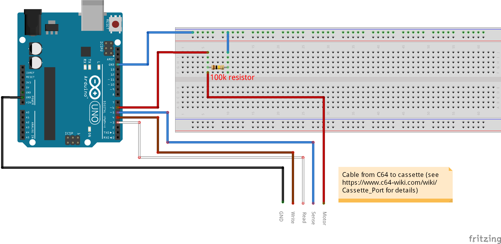
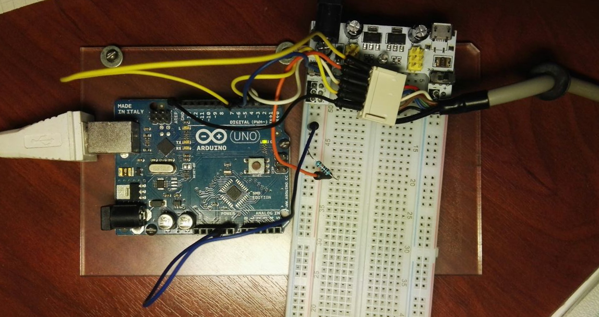

# uno2tapGUI
A simple C64 cassette emulator using an Arduino UNO and a Java program.

This is a rewrite of [uno2tap by Mike Dawson](https://gp2x.org/uno2tap/).

## Arduino Setup
DISCLAIMER: it worked on my hardware and it should work on any hardware but i will not be responsible of any damage!
YOU are connecting YOUR C64 to YOUR Arduino and PC, so it's YOUR fault if something goes wrong. Keep this in mind.

Firstly upload the sketch to your Arduino like usual.

The hardware setup is pretty easy. Just connect the cable as shown in the schematic.
The resistor is necessary to let the motor control work. In this way we let the parasitic capacitance 
of the internal MosFET to discharge, so we can read the correct value with Arduino.
The internal resistance of Arduino, when in high impedence (input) mode, is too high. 

| Pin name | Pin number | C64 name | Cable color|
|----------|------------|----------|------------|
|PIN_MOTOR |6           | MOTOR    | RED        |
|PIN_READ  |3           | READ     | WHITE      |
|PIN_WRITE |4           | WRITE    | BROWN      |
|PIN_SENSE |5           | SENSE    | BLUE       |

Here is the schematic:

And here is an image of my setup. Notice how i used a cable from a not working Datasette.

## Computer (server) setup
You need to download the rxtx library in order to use this program. See [here](http://rxtx.qbang.org/wiki/index.php/Installation) for details.

Important: if you download the 32bit version of the dll, the program will actually work only with the 32bit version of the Java Virtual Machine!

Just compile the program and run it. I used IntelliJ Idea.

## How to use this program
Connect your Arduino with the C64 as described and connect it to your computer

Launch the program and press "Connect"
 
Insert your port and press Ok. Usually the port name on Windows is `COM1` or `COM2`. It may vary on other platforms 
(on Linux is usually `/dev/ttyACM0`).

Press Open and select a TAP file

On the C64 type `LOAD` and hit enter (as you would normally do)

Press Play on the Java app

Make yourself a coffee :)

Play your favourite games!

It should work with every custom loader.
Tested with Tetris

